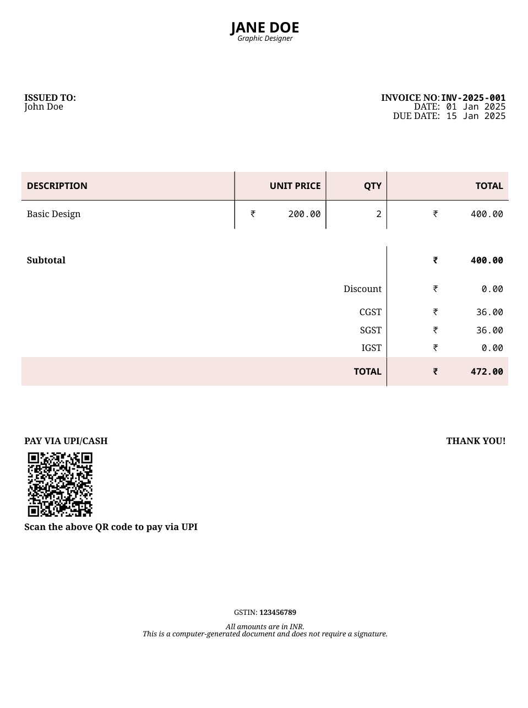
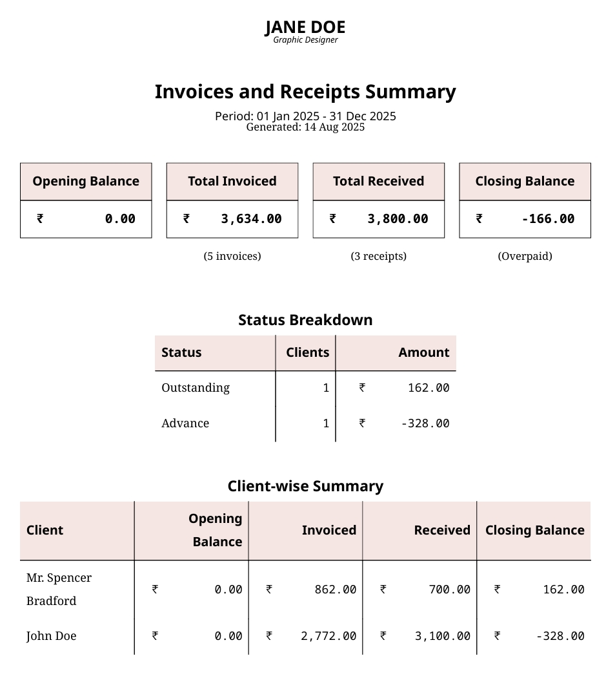
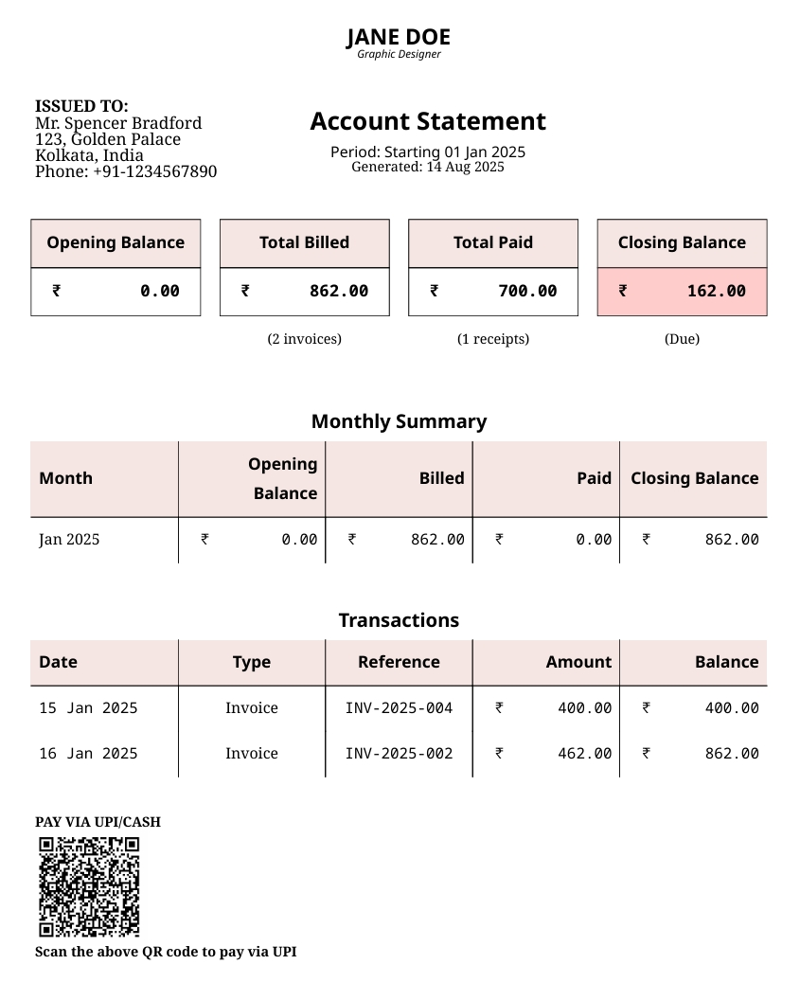

# Introducing BulkInvoicer

I am excited to announce the launch of a new CLI tool [BulkInvoicer]. BulkInvoicer helps you manage your invoices and receipts in bulk in a simple offline-friendly way.

## ✨ Features at a Glance

BulkInvoicer is packed with features designed to simplify your invoicing workflow. Here’s a quick overview:

- **📁 Excel-Based Workflow**  
  Use your existing spreadsheet to manage invoices—no need to switch platforms.

- **🖨️ Beautiful Invoice Generation**  
  Create professional, printable invoices directly from your Excel data.

- **🎨 Fully Customisable Templates**  
  Adjust colours, headers, footers, fields, and payment lines to suit your brand.

- **📱 UPI QR Code Support**  
  Automatically embed UPI QR codes for instant payments (where supported).

- **📊 Summary Pages**  
  Generate overall and client-specific summaries for tax filing or client reporting.

- **📄 PDF Output Options**  
  Export combined, client-wise, or individual invoice PDFs with optional account summaries.

- **🔄 Auto-Matching Receipts**  
  Automatically match invoices with receipts and track advance payments.

- **⚙️ Simple TOML Configuration**  
  Customise output types, styles, and preferences with a lightweight config file.

- **🔒 Offline & Open Source**  
  Works entirely offline and is fully open-source—ideal for privacy-conscious users.

<!-- more -->

## The Problem

Managing invoices can be challenging, especially when relying on complex ERP systems. Many small businesses and independent professionals tend to keep records locally using tools like Excel. A simple spreadsheet can be used to manage a list of all your invoices.

Here's an example of how many professionals currently manage invoices using spreadsheets:

| Date      | Invoice No | Client   | Description              | Amount (₹) | Discount (₹) | Tax (₹) |
| --------- | ---------- | -------- | ------------------------ | ---------- | ------------ | ------- |
| 01-Aug-25 | INV-001    | Client A | In-person design Session | 1500       | 0            | 0       |
| 03-Aug-25 | INV-002    | Client B | Advanced Graphic Design  | 25000      | 1000         | 0       |
| 05-Aug-25 | INV-003    | Client C | In-person design Session | 2000       | 0            | 0       |
| 07-Aug-25 | INV-004    | Client A | Basic Graphic Design     | 1000       | 0            | 0       |
| 09-Aug-25 | INV-005    | Client D | Advanced Graphic Design  | 40000      | 0            | 2000    |
| 10-Aug-25 | INV-006    | Client B | In-person design Session | 1500       | 0            | 0       |

## Solution

BulkInvoicer lets you do just that—track all your invoices in Excel while generating professional-looking invoices for your clients. BulkInvoicer is fully open-source and works entirely offline—making it an ideal solution for privacy-conscious users.

{width="500" loading=lazy data-title="A sample invoice generated by BulkInvoicer"}
///caption
A sample invoice generated by BulkInvoicer
///

Invoices are fully customisable. You can modify attributes such as colour, visible fields (e.g. tax and discount), headers and footers, and even payment and signature lines.

In addition, if you are in a country where UPI is supported, you can include a UPI QR code automatically on all invoices with your UPI ID and the invoice amount pre-filled. This enables your customers to scan the invoice and make a payment instantly.

{width="500" loading=lazy data-title="A sample summary generated by BulkInvoicer"}
///caption
Sample summary generated by BulkInvoicer
///

BulkInvoicer also supports creating beautiful overall and client summary pages. This can then be directly sent to your clients or tax preparer to help you file your tax returns.

PDFs can be generated on a per-client basis, which you can then directly mail to your clients. Each PDF includes an optional account summary along with all invoices and receipts generated for that client. The account summary also has payment information to allow your clients to quickly clear their outstanding dues.

{width="500" loading=lazy data-title="A sample account summary generated by BulkInvoicer"}
///caption
Sample account summary generated by BulkInvoicer
///

BulkInvoicer also automatically matches all invoices and receipts and keeps track of advance payments. This makes it ideal for simple scenarios where clients pay incrementally rather than against specific invoices.

Currently, BulkInvoicer uses a simple TOML-based config to allow users to specify custom preferences, style choices, payment information and even detailed information on what outputs the program should generate.

??? example "A sample config.toml file"
    ```toml title="sample.config.toml"
    --8<-- "docs/blog/assets/introducing-bulkinvoicer/sample.config.toml"
    ```

    1. Just use the same name as used in your excel file.
    2. Basic markdown is supported. It is possible to use `**bold**`, `__italics__`, `~~strikethrough~~` or `--underlined--`
    3. Can be set to combined, individual, or clients

    You can find the [full file on GitHub](https://github.com/yashovardhan99/bulkinvoicer/blob/main/sample.config.toml)

The script can generate 3 types of files:

- A combined file with all invoices and receipts for a particular period
- Client-wise files where each file has all invoices and receipts for a particular client
- All individual invoices and receipts as separate files.

You can specify the time period for generating these files, and also whether to include a summary or not. You can mix and match output types to generate multiple files in a single run.

## Who Is It For?

BulkInvoicer is ideal for:

- Freelancers who want a lightweight invoicing solution
- Small business owners managing clients and payments
- Professionals who prefer working offline and value privacy
- Anyone tired of complex ERP systems and looking for simplicity

## Get Started

BulkInvoicer is designed to simplify your invoicing workflow without the overhead of complex systems. Installation is simple, and you can start generating invoices in minutes. Whether you're a freelancer or a small business owner, give it a try and let us know what you think! BulkInvoicer is lightweight, easy to configure, and works entirely offline—perfect for privacy-conscious users.

Ready to start invoicing?

[Check out BulkInvoicer]{ .md-button .md-button--primary }

[BulkInvoicer]: http://github.com/yashovardhan99/bulkinvoicer/
[Check out BulkInvoicer]: http://github.com/yashovardhan99/bulkinvoicer/